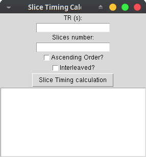

# Welcome to my scripts to Dicom images

## heudiconv.py
This scripts is a GUI to heudiconv. You need to copy the paths to original images, destinatios folder and your heuristic file. In the GUI you need to introduce the codes to convert into BIDS. Is just a silly tool with GUI to create a easy way to convert images based on Heudiconv.

## slicecal.py
Sometimes when you manage dicom images from Philips scanner the conversion to nifit with dcm23niix the slicetiming is missing. With this calculator you could have the section of slice timing to insert in yor json. You need to know TR, Slices and Order.

## Pipeline to work with CAMINO to estimate DTI
Install CAMINO, FSL and ANTs

files and path: \
--|Code\
----|DWI\
------|data.nii.gz
------|bvecs
------|bvals
----|T1\
------|T1.nii.gz

for code in $(cat ~/codelist.txt)
	do
  
cd $path/$code/

	mkdir CAMINO
	mkdir DTIFIT
	mkdir DTItk
	cp -R DTI DWI

	cd $path/$code/DWI
	
## correction with FSL

	fsl5.0-eddy_correct $DWI data.nii.gz 1
	cp xDTIhighisoSENSE_33.bvec bvecs
	cp bvecs bvectemp
	mv bvecs bvectemp

## convert bvals and bvecs to Camino format 

	psc -r < bvectemp | sc -W% - > grad_dirs.txt
	rm bvectemp	

## BET extraction
	fsl5.0-bet $DWI nodif_brain.nii.gz -f .3 -m

	cp nodif_brain_mask.nii.gz $path/$code/CAMINO
	cp grad_dirs.txt $path/$code/CAMINO

## Model Estimation with Camino
	cd $path/$code/CAMINO

	pointset2scheme -inputfile grad_dirs.txt -bvalue 1E9 -outputfile 4Ddwi_b_bvector.scheme
	image2voxel -4dimage ../DWI/data.nii.gz -outputfile dwi.Bfloat
	
	dtfit dwi.Bfloat 4Ddwi_b_bvector.scheme -bgmask nodif_brain_mask.nii.gz -outputfile dt.Bdouble
	modelfit -inversion 2 -schemefile 4Ddwi_b_bvector.scheme -inputfile dwi.Bfloat -bgmask nodif_brain_mask.nii.gz > dt_nonlinear.Bdouble

		for PROG in fa md; do
		  cat dt.Bdouble | ${PROG} | voxel2image -outputroot ${PROG} -header ../DWI/$DWI
		done
	cat dt_nonlinear.Bdouble | dteig > dteig.Bdouble
	dt2nii -inputfile dt_nonlinear.Bdouble -outputroot nifti_ -header ../DWI/$DWI
	#visualizador de primer nivel de Camino
	#pdview -inputfile dteig.Bdouble -scalarfile fa.nii.gz
	
	cd $path/$code/
	fsl5.0-dtifit -k DWI/data.nii.gz -o DTIFIT/data -m DWI/nodif_brain_mask.nii.gz -r DWI/bvecs -b DWI/bvals -w

done
